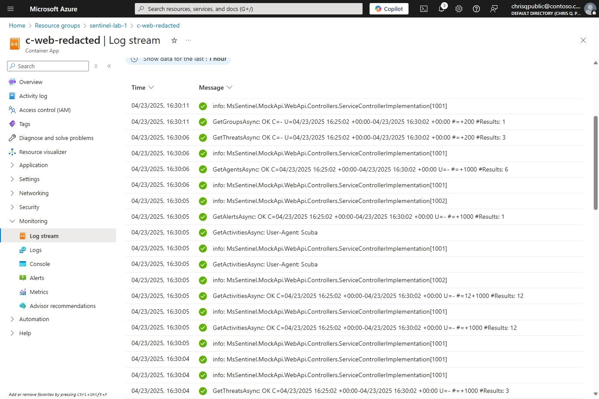

# Microsoft Sentinel Hands On Lab #1

In this lab, participants will set up a Microsoft Sentinel workspace, and connect a Codeless Connector Platform-based connector to a live API endpoint. With that in place, they'll explore common components deployed in a Microsoft Sentinel solution, including: Workbooks, parsers, and analytics rules. Finally, we'll make a few changes to those components using the Sentinel UI.

## Prerequisites

To participate in this lab, you will first need:

* An Azure Account. Set up a [Free Azure Account](https://azure.microsoft.com/en-us/pricing/purchase-options/azure-account) to get started.
* [Azure CLI tool with Bicep](https://learn.microsoft.com/en-us/azure/azure-resource-manager/bicep/install#azure-cli)
* A git client, e.g. [Git for Windows](https://gitforwindows.org/)
* Execution policy configured to run PowerShell scripts, see [About Execution Policies](https://learn.microsoft.com/en-us/powershell/module/microsoft.powershell.core/about/about_execution_policies)
* A code editor, e.g. [Visual Studio Code](https://code.visualstudio.com/)

## Setup

Please complete these steps before beginning the lab.

### 1. Clone this repo

Clone this repo with submodules so you have the [AzDeploy.Bicep](https://github.com/jcoliz/AzDeploy.Bicep) project handy with the necessary module templates.

```powershell
git clone --recurse-submodules https://github.com/jcoliz/MsSentinel.HandsOnLab.1.git
```

### 2. Log into Azure

In a terminal window, ensure you are logged into Azure

```dotnetcli
az login
```

Then verify that the subscription you're logged into is where you want to deploy. Make adjustments as needed.

```dotnetcli
az account show
```

## Deploy resources

In this lab, you will create a resource group and deploy the following resources to your Azure subscription:

* Sentinel-enabled Log Analytics Workspace
* Azure Container App serving a synthetic API endpoint

To deploy these, run the [Deploy-Services.ps1](./Deploy-Services.ps1) script. Supply a resource group name and
Azure datacenter location according to your preference.

```dotnetcli
.\Deploy-Services.ps1 -ResourceGroup mssentinel-lab-1 -Location westus
```

When this script completes, it will pass along some helpful information. Be sure to record the displayed endpoints URL.

```dotnetcli
Deployed sentinel workspace sentinel-redacted
Synthetic endpoints available at https://c-web-redacted.westus.azurecontainerapps.io/

When finished, run:
az group delete --name mssentinel-lab-1
```

## Review resoruces

### Check deployed resources


Perform the following steps to review what you have just deployed.

1. Visit the Azure Portal at [portal.azure.com](https://portal.azure.com)
1. Log in with the same credentials used when logging into the Azure CLI tool, above
1. Navigate to "Resource groups"
1. Click on the resource group which you supplied to the `Deploy-Services` script, above

You will see the following resources deployed:

* Container App `c-web-` which runs a synthetic API endpoint service
* Container Apps Environment `cenv-` which hosts the Container App
* Sentinel Solution `SecurityInsights(sentinel-` the Sentinel analytics layer on top of log analytics
* Log Analytics Workspace `sentinel-` the underlying log analytics workpace containing our Sentinel data

### Enable Sentinel Health monitoring


Always ensure that health monitoring is enabled on any Sentinel workspace before doing _anything_ in it.

1. Begin in the Azure Portal
1. Choose the "Microsoft Sentinel" service.
1. Click on the name of the resource we deployed above. Use the resource group for reference. 
1. Click Settings > Settings
1. Expand the Auditing and Health Monitoring section
1. Click the "Enable" button

### Explore the API endpoint


Let's visit the swagger UI page for our synthetic endpoints. Note the output of the `Deploy-Services` script above, which gave you a URL ending in `.azurecontainerapps.io/`. Paste that URL into your browser address bar, followed by `swagger`. For example: `https://c-web-redacted.westus.azurecontainerapps.io/swagger`.

From here, take some time to familiazize yourself with the "SyntheticS1" group of endpoints. These endpoints will be used when we deploy the CCP connector.

## Install and connect a connector

### Install a solution from Content Hub 


For our use today, we'll install the "Sentinel One" solution from the Sentinel Content Hub.

1. Begin in the overview page for our Sentinel workspace.
1. Click "Content Hub" on the left navigation pane, located under "Content management"
1. In the Search box above the solutions list, type "SentinelOne"
1. Select the "SentinelOne" solution
1. In the right details pane, click "Install"

### Connect a data connector


Enable the CCP data connector contained within this solution.

1. Begin in the overview page for our Sentinel workspace.
1. Click "Data connectors" on the left navigation pane, located under "Configuration"
1. Select the "SentinelOne" data connector. Not the one using Azure Functions!
1. In the right details pane, click "Open connector page"
1. In the text box labeled "SentinelOne Management URL", enter the URL output by the `Deploy-Services` script. Note that in this case, we do not want `swagger` attached. Only the part ending in ending in `.azurecontainerapps.io/`
1. Enter any value in API token, or leave it blank
1. Press "Connect"

### Check deployment logs


Let's make sure our connector deployment was successful.

1. Begin in the Azure Portal.
1. Navigate to "Resource groups"
1. Click on the resource group which you supplied to the `Deploy-Services` script, above
1. Click on "Deployments" under the "Settings" group on the left navigation pane
1. Look for a deployment named "DataConnector-SentinelOneCCPConnections"
1. Look for a status of "Suceeded"
1. Click into the deployment, and expand Deployment details
1. You'll see seven unique dataConnector resources deployed. Each is an independent poller connecting to one of our synthetic endpoints

### Check app logs for connection check


To verify that the connection check has completed for each of these pollers, we can check the logs for our synthetic endpoints app.

1. Begin in the Azure Portal.
1. Navigate to "Resource groups"
1. Click on the resource group which you supplied to the `Deploy-Services` script, above
1. Click on the `c-web-` resource
1. Click on "Log stream" under "Monitoring" on the left navigation pane
1. Click "Real-time" under "Display"
1. Click "Application" under "Cagegory"

You'll see a stream of logs. Each one of these pairs of lines is a unique call to the synthetic endpoints. You should see 8 logs of event type `[1001]`. There is one call for each endpoint, plus an extra one because one endpoint required two calls to get through all the pages.

```log
2025-04-30T21:03:02.762038777Z info: MsSentinel.MockApi.WebApi.Controllers.ServiceControllerImplementation[1001]
2025-04-30T21:03:02.762073121Z       GetAgentsAsync: OK C=- U=04/30/2025 20:55:02 +00:00-04/30/2025 21:00:02 +00:00 #=+200 #Results: 6
```

### Now, we wait

It can take up to 30 minutes before the pollers all start functioning. This is a great time to take a break and go catch some fresh air.

## Confirm data is flowing

### Wait for more app logs



You'll know the connector is running when you see more connections come in on the application log stream. Wait here on this page until you see these calls coming in.

### Check DCR rule metrics


Our first step in verifying data is to ensure the Data Collection Rule (DCR) received the logs.

1. Begin in the Azure Portal.
1. Navigate to "Resource groups"
1. Click on the resource group which you supplied to the `Deploy-Services` script, above
1. Click on the Data Collection Rule resource
1. Click "Metrics" under "Monitoring" on the left navigation pane
1. On the chart controls, Select the "Metric" drop-down
1. Choose "Logs Ingestions Requests per Min"
1. On the timespan picker (upper-right), select "Last 30 minutes"

From here, you can see log ingestion requests coming into the DCR.

### Check liveness queries


The data connector page displays helpful liveness quereies to validate that data is flowing.

1. Begin in the overview page for our Sentinel workspace.
1. Click "Data connectors" on the left navigation pane, located under "Configuration"
1. Select the "SentinelOne" data connector. Not the one using Azure Functions!
1. In the right details pane, click "Open connector page"
1. Notice that the status is "Connected" and shows green.
1. Notice the "Last Log Received" was recently updated. You may need to refresh the page.
1. Notice the "Data received" graphs
1. Notice the "Data types" are all green

### Check data in logs


1. Begin in the connector details page
1. Click on one of the green data types, e.g. "SentinelOneActivities_CL"
1. Remove the bottom two clauses (summarize and 2nd where clause)
1. Run the query
1. Notice lots of synthetic activity details

### View health table


After the connector has been up for at least an hour, you'll start to see data in the Sentinel Health table. You remembered to enable Sentinel Health monitoring in the initial steps, right?

1. Begin in the overview page for our Sentinel workspace.
1. Click "Logs" on the left navigation pane
1. Click "+" on query tabs to create a new query
1. Type "SentinelHealth" into the query box
1. Click "Run"
1. Explore the Sentinel Health records

## Edit Sentinel components

Now that we have data flowing into the SentinelOne solution, we can make some edits to the solution to clean it up for better presentation. This will give us a bit of experience making changes to solution components.

### Workbook


When deployed, the workbook template doesn't show the "Agents by Version" graph correctly. We will update the query used for this pane, and save the modified workbook so it's ready for us to use again later. The screen shot above shows the final result.

The KQL we will need to display this pane correctly is:

```kusto
SentinelOne
| where Type == "SentinelOneAgents_CL"
| summarize count() by AgentVersion
```

Follow these instructions to make the needed correction:

1. Begin in the overview page for our Sentinel workspace.
1. Click "Workbooks" on the left navigation pane
1. Click "Templates" in the tab picker just above the search box
1. Click "SentinelOneWorkbook" in the results list
1. Click "Save" in the details pane on the right, and choose a location where to save it. Now we have an editable copy.
1. Click "My workbooks" in the tab picker just above the search box. Now you will see the SentinelOneWorkbook there.
1. Click "SentinelOneWorkbook" in the results list
1. Click "View saved workbook" in the details pane on the right
1. Click "Edit" in the top tool bar, just under the page title
1. Find the "Agents by version" pane. Click the "Edit" button in the bottom right of that pane
1. Replace the query with the text shown above. Click "Run Query" to see the results
1. Click the "Done Editing" button *at the bottom of the pane* to finish editing the pane
1. Click the "Done Editing" button in the top tool bar. Make sure you've *first* clicked "Done Editing" on the pane itself!!

### Parser


When deployed, the `SentinelOne` parser has an erroneous clause in its query. This will show warnings in the dashboard and in other areas where the parser is used.

We will need to make the following change in the query for the `SentinelOne` parser function.

```diff
-        let SentinelOneV1Empty_Union= union isfuzzy=true SentinelOne_CL,SentinelOneV1_Empty
+        let SentinelOneV1Empty_Union= union isfuzzy=true SentinelOneV1_Empty
```

1. Begin in the overview page for our Sentinel workspace.
1. Click "Logs" on the left navigation pane
1. Click the "Functions" icon button in the stack to the left of the "Run" button
1. Expand "Workspace Functions"
1. Scroll down until "SentinelOne" comes into view
1. Hover over "SentinelOne" until the actions pane comes up
1. Click "Load code into editor" on the actions pane
1. In the editor, press Ctrl+F to bring up a find windoe
1. Type in "SentinelOne_CL" to find the line where change is needed
1. Update this line as shown in the diff above
1. Click "Run" to ensure the query runs properly
1. Click "Save" in the tool bar to the right of the tabs list. Then click "Save" again to overwrite the existing query.

The workbook will now show up without warnings about invalid function syntax.

### Analytics rule


When deployed, the "Sentinel One - Agent uninstalled from multiple hosts" has an error in its logic which will prevent it from ever being fired.

We will need to make the following change in the query for this rule, which we will do whilst also activating the rule.

```diff
SentinelOne
| where ActivityType == 51
| summarize count() by DataComputerName, bin(TimeGenerated, 30m)
-| where count_ > 1
```

The existing rule will fire when the agent has been installed multiple times *on the same machine*, which is not what we're looking for. Once it's uninstalled from one machine, the chances of it being unsinstalled from the same machine is very low. 

1. Begin in the overview page for our Sentinel workspace.
1. Click "Analytics" on the left navigation pane
1. Click "Rule templates" in the tab picker just above the search box
1. Enter "uninstalled" into the search box
1. Click the rule "Sentinel One - Agent uninstalled from multiple hosts"
1. Click the "Create rule" button in the details pane on the right
1. Click "Set rule logic" in the tab picker just below the page title
1. Click "Test with current data" in the Results Simulation pane to the left. Notice that no results are found.
1. Edit the "Rule query" box by making the change described above
1. Click "Test with current data" in the Results Simulation pane to the left. Notice that many results are found.
1. Scroll down to the "Alert threshold" section
1. Enter "1" in the box next to "Is greater than". This retains the spirit of the rule that it only fires when multiple machines are found to have uninstalled the agent.
1. Click "Review + create" in the tab picker just below the page title
1. Wait patiently for validation to complete
1. Click "Save"

After this rule has been running for a while, you can come back to the "Incidents" page, to find that many incidents have been created from your new rule.

## Tear down

When you're done, simply tear down the entire resource group. Supply the name you chose in the initial deployment step to delete the correct resoruce group.

```dotnetcli
az group delete --name mssentinel-lab-1
```

Alternately, you could keep the resource group up for future use, but just disconnect the connector. Doing so will stop data from flowing in, and driving up your data consumption charges.
